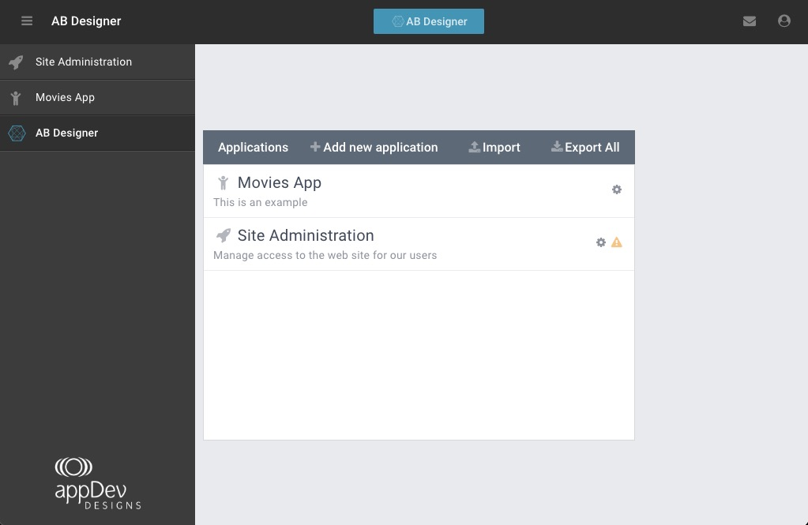
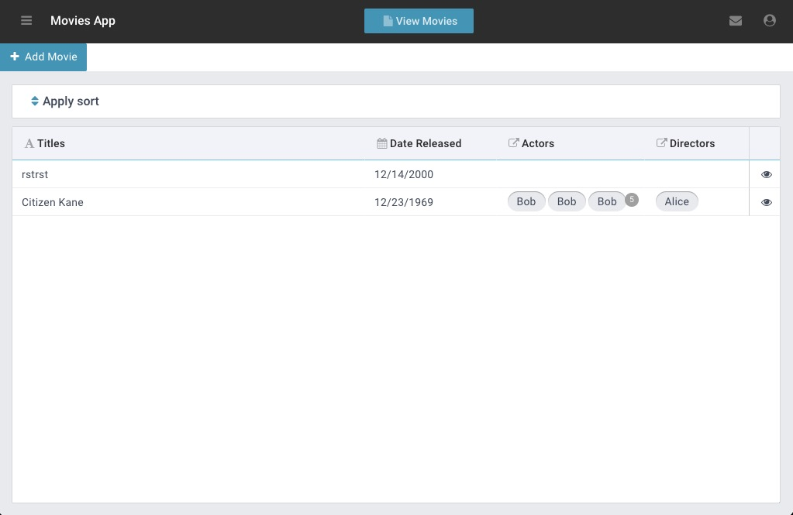
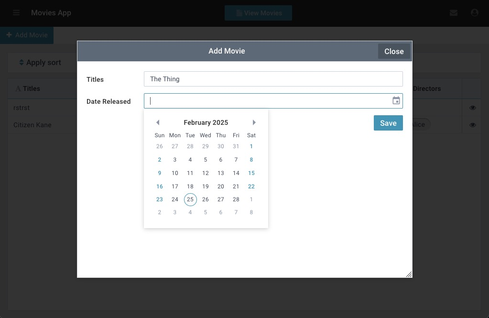
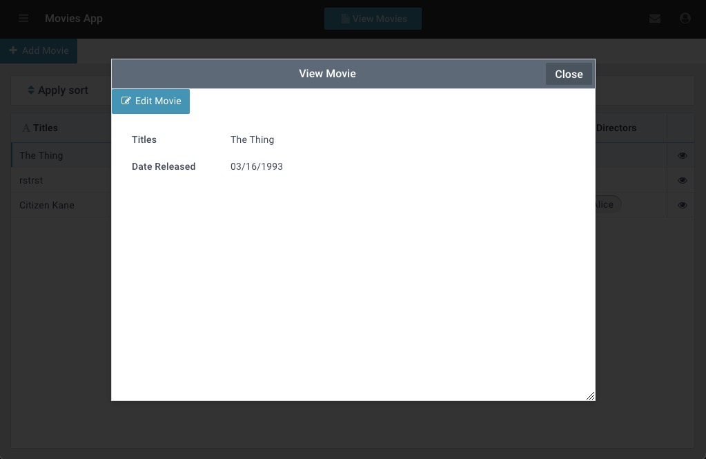
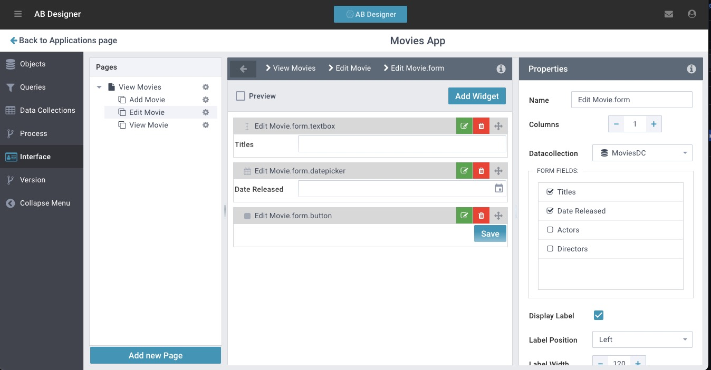
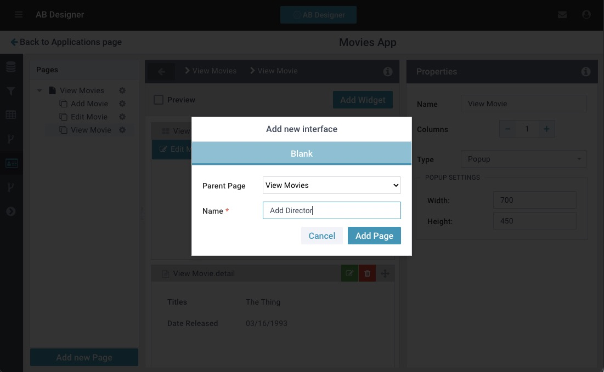
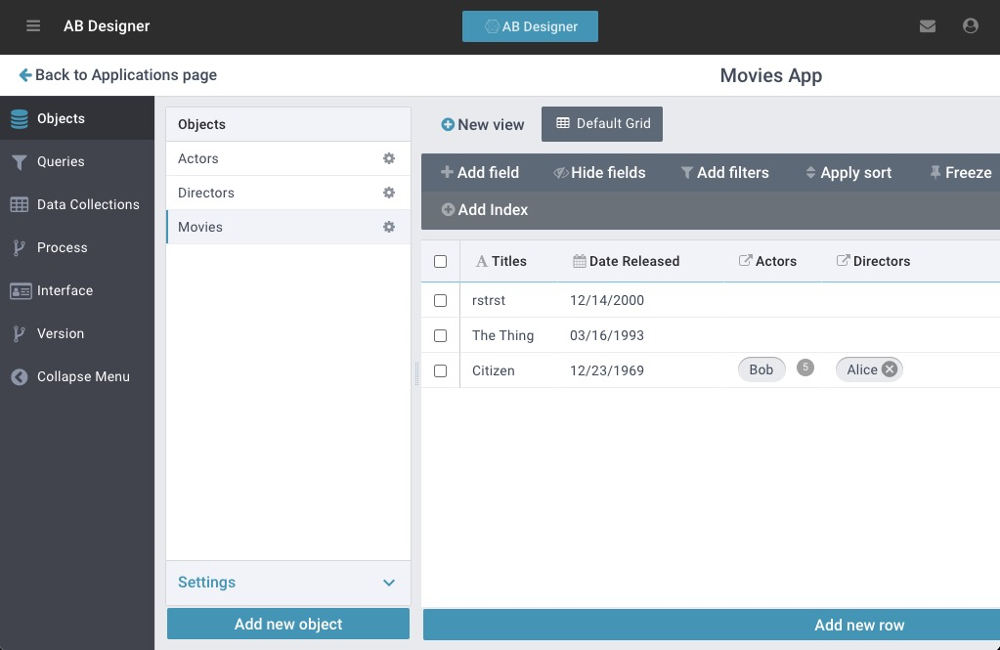
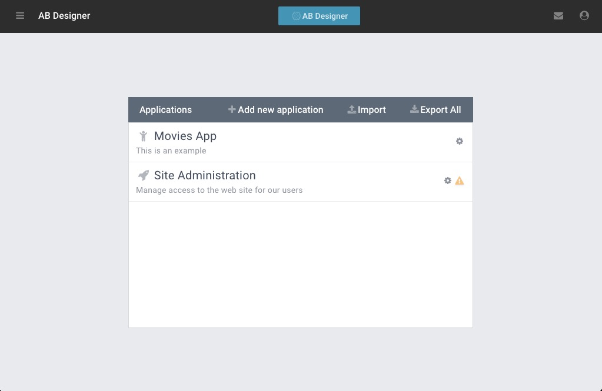

# AppBuilder: Open Source No-Code Platform

Welcome to the **AppBuilder** repository! This project showcases an open-source, no-code database and UI builder designed as an alternative to CRMs such as Salesforce. 
It allows users to define data structures, create interactive UIs, and build dynamic web applications—all without writing code. 

[](https://digi-serve.github.io/appbuilder_docs/user/demo/DemoVideo.html)

## About AppBuilder
AppBuilder empowers users to:
- Define **Objects** (tables) to store structured data.
- Create **Queries** to [filter](https://digi-serve.github.io/appbuilder_docs/user/concepts/filters/Filters.html) and retrieve data dynamically.
- Build **DataCollections** (user-facing objects) that adapt to user scope and UI selections.
- Design **UI Elements** such as pages, popups, grids, forms, and [export options (PDF, Word, CSV)](https://digi-serve.github.io/appbuilder_docs/user/cars_module/new%20child/Add%20Child.html)
- Deploy your applications without complex backend setup.
- Share **Modules**: all applications can be easily exported or imported*

*Imported modules are like a spreadsheet with all the formulas-- data is not included.   
[Example, initial setup of our Children at Risk AFTER module is imported](https://digi-serve.github.io/appbuilder_docs/user/cars_module/initial_setup/Initial%20Setup.html)

AppBuilder is actively used in multiple production environments!

## 📂 What's in This Repository?
This repository provides everything needed to explore AppBuilder, including:
- **Example JSON setup** to create a demo 'movie' app.
- **Cypress tests** for automated testing.
- **Docker Compose configuration** to deploy AppBuilder in production mode.
- **GitHub Actions workflow (`docker-compose.yml`)** as an example of how to set up the environment.

## 🛠️ Getting Started
### Prerequisites
Ensure you have the following installed:
- [Docker & Docker Compose](https://docs.docker.com/get-docker/)
- [Node.js & npm](https://nodejs.org/) (for Cypress tests)

### Running the Demo
1. Clone the repository:
   ```sh
   git clone https://github.com/achoobert/ab_demo.git
   cd appbuilder-demo
   ```
2. Start AppBuilder using Docker Compose:
   ```sh
   mv .env.example .env
   docker compose up -d
   cd ./defs && ./upload.sh
   ```
3. Access AppBuilder in your browser at `http://localhost:8080` (or the configured port).

### Running Cypress Tests
1. Install dependencies:
   ```sh
   npm install
   npm run start_ab
   npm run setup_definitions
   ```
2. Run the Cypress tests:
   ```sh
   npm run test
   ```

## 🤝 Contributing
We welcome contributions! Feel free to submit issues or pull requests to improve AppBuilder.

## 📜 License
This project is open-source under the [MIT License](LICENSE).

---
### 🌟 Try AppBuilder Today!
This repository serves as an introduction to our FOSS offering. The goal is to enable anyone to test and explore the power of AppBuilder. Give it a try and start building your no-code applications today!

For questions, reach out via issues or discussions. Happy building! 🚀

## Screenshots

Appbuilder Designer homescreen with navigation sidebar open


Minimal top page of an app: featuring a menu with links and a grid with data


A sub-page set to open as a non-intrusive popup. This features a simple form widget


Another popup, featuring a detail widget for displaying data about a selected record


This is the UI the 'builder' uses when making the app



The object view



## 🔜 TODO
- Add a script to initialize a demo version on the user's machine.
- Improve automation for local setup.
solve no ingress network issue